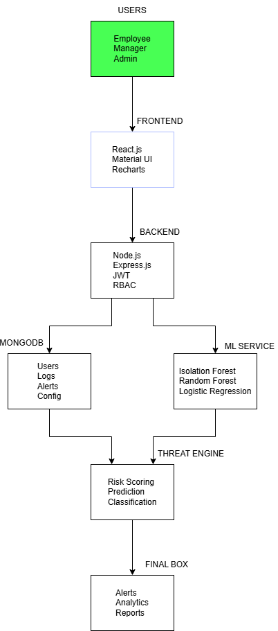
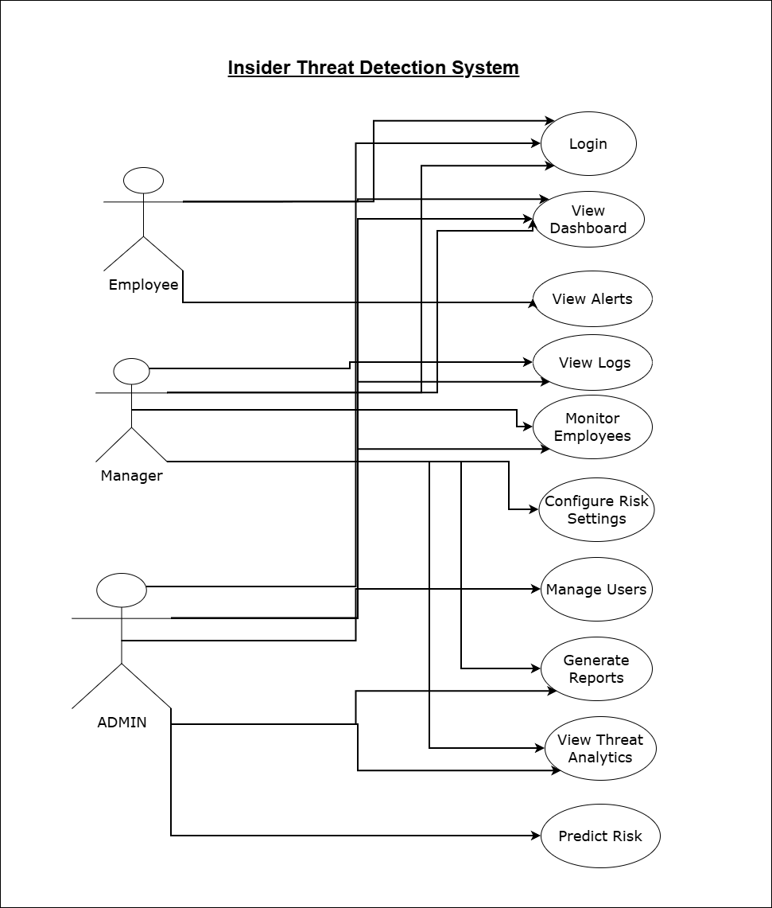
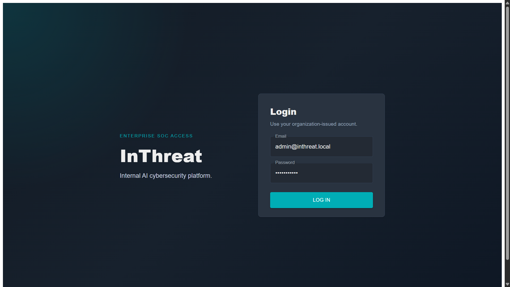
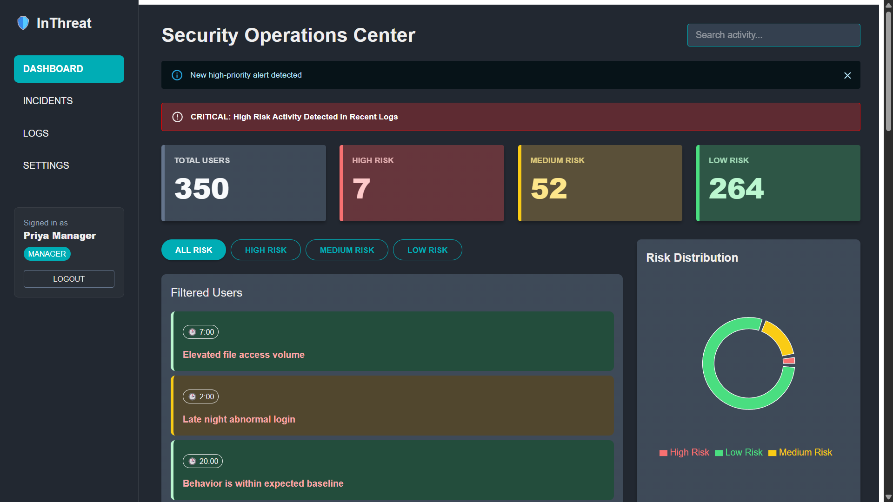
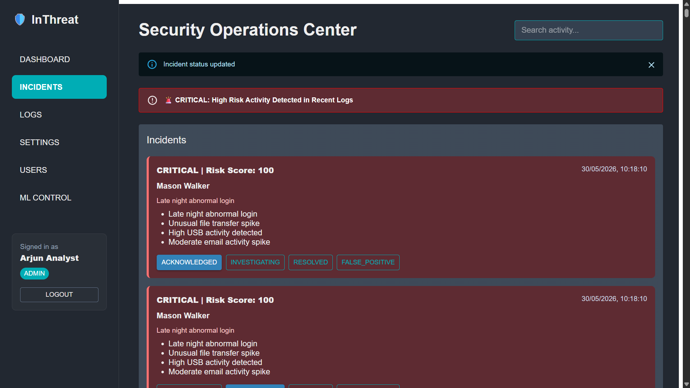
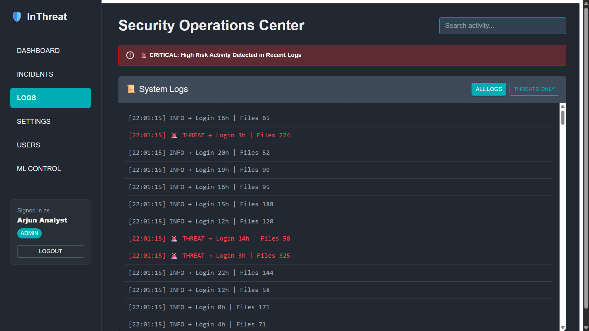
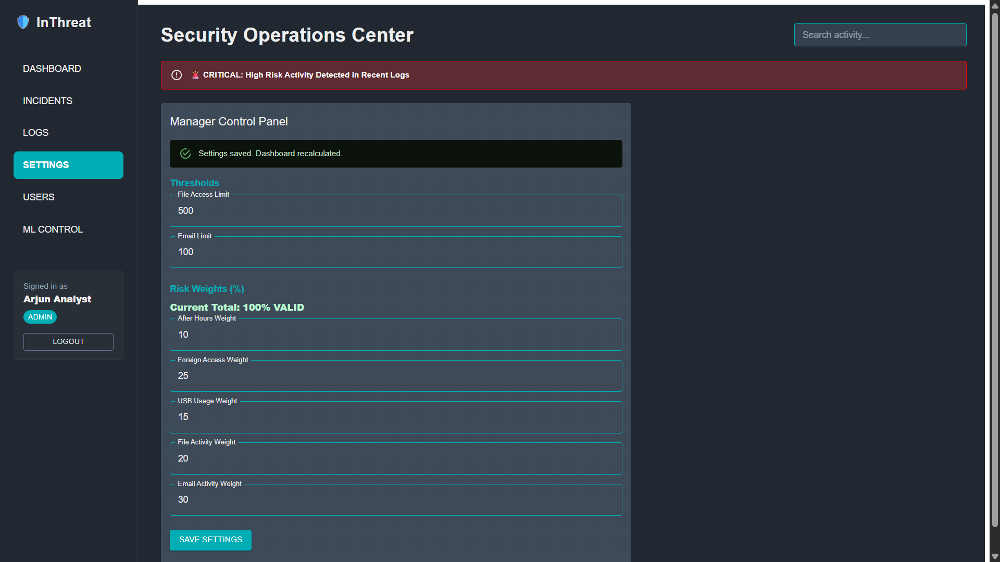
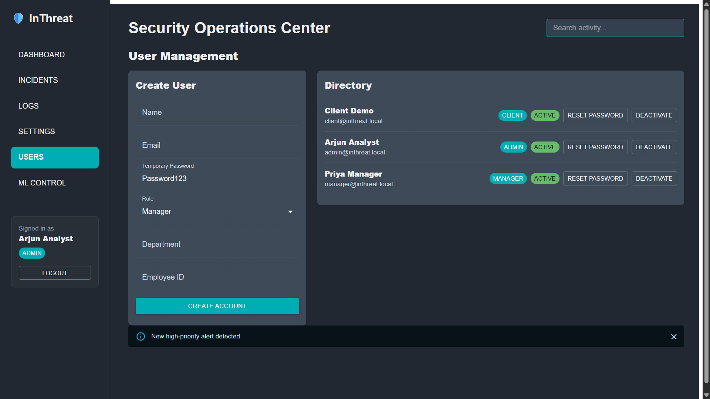

# In_Threat – AI-Powered Insider Threat Detection System

🎥 **Project Demo Video**

Watch the complete project demonstration:

**https://www.loom.com/share/e6da3b8d8e4e466fa41828006ab95b79**

---

## Overview

In_Threat is an AI-powered Insider Threat Detection System designed to identify suspicious employee activities through behavioral analytics, machine learning, and role-based access control (RBAC).

The platform continuously monitors employee actions, evaluates risk levels, detects anomalous behavior patterns, and generates real-time security alerts to help organizations mitigate insider threats before they escalate into critical security incidents.

---

## Key Features

### Authentication & Authorization

* JWT Authentication
* Secure Login System
* Role-Based Access Control (RBAC)
* Admin, Manager, and Employee Roles

### Threat Detection & Analytics

* Insider Risk Scoring
* Behavioral Analytics
* Machine Learning Threat Detection
* Real-Time Risk Evaluation
* Anomaly Detection using Isolation Forest

### Monitoring & Investigation

* Employee Activity Monitoring
* Alert Generation & Management
* Activity Log Tracking
* Risk Trend Analysis
* Threat Investigation Support

### Administration

* User Management
* Manager Configuration Panel
* Risk Threshold Management
* Monitoring Rule Configuration

---

## System Architecture

### Architecture Diagram



### Use Case Diagram



---

## Technology Stack

### Frontend

* React.js
* Material UI
* Axios
* Recharts

### Backend

* Node.js
* Express.js
* JWT Authentication

### Database

* MongoDB
* Mongoose

### Machine Learning

* Python
* Scikit-Learn
* Isolation Forest
* Pandas
* NumPy

---

## Project Structure

```text
IN_THREAT/

├── backend/                 # Backend APIs & Authentication
├── frontend/                # React Dashboard
├── ml/                      # ML Prediction Services
├── models/                  # Trained ML Models
├── configs/                 # Configuration Files
├── data/                    # Datasets
├── notebooks/               # Model Experimentation
├── screenshots/             # Documentation Assets

├── README.md
├── requirements.txt
└── .gitignore
```

---

## Application Screenshots

### Login Page



---

### Dashboard Overview

#### Admin Dashboard

.png)

#### Monitoring Dashboard

.png)

---

### Risk Prediction



---

### Alerts Management



---

### Activity Logs



---

### Manager Configuration Panel



---

### User Management



---

## Machine Learning Module

The system leverages machine learning techniques to identify abnormal employee behavior and calculate insider threat risk scores.

### Features Used

* File Access Count
* Email Activity
* Failed Login Attempts
* USB Usage
* Login Time Patterns
* Network Activity

### Detection Model

#### Isolation Forest

Used to identify anomalous employee behavior patterns that significantly deviate from normal activity.

### Risk Assessment

The model generates employee risk scores based on behavioral indicators and anomaly detection outputs, enabling proactive threat mitigation.

---

## Installation

### Clone Repository

```bash
git clone https://github.com/Shravan-0/Insider_Threat_Detection.git

cd Insider_Threat_Detection
```

---

### Backend Setup

```bash
cd backend

npm install

npm start
```

---

### Frontend Setup

```bash
cd frontend

npm install

npm start
```

---

### Machine Learning Service

```bash
cd ml

pip install -r requirements.txt

python predict.py
```

---

## Security Features

* JWT Authentication
* Role-Based Authorization
* Protected API Endpoints
* User Access Management
* Behavioral Monitoring
* Insider Threat Detection
* Risk-Based Alert Generation

---

## Future Enhancements

### Security Enhancements

* Explainable AI (XAI)
* SIEM Integration
* Threat Intelligence Feeds
* Automated Incident Response

### Infrastructure

* Docker Deployment
* Kubernetes Support
* Cloud Hosting
* CI/CD Pipelines

### Advanced Analytics

* User Behavior Analytics (UBA)
* Predictive Risk Forecasting
* Real-Time Streaming Analytics

### Compliance & Auditing

* Blockchain-Based Audit Logging
* Immutable Security Records
* Compliance Reporting

---

## License

This project is licensed under the MIT License.

---

## Author

**Shravan Kumar**

Cybersecurity | Machine Learning | Blockchain Security

GitHub: https://github.com/Shravan-0
